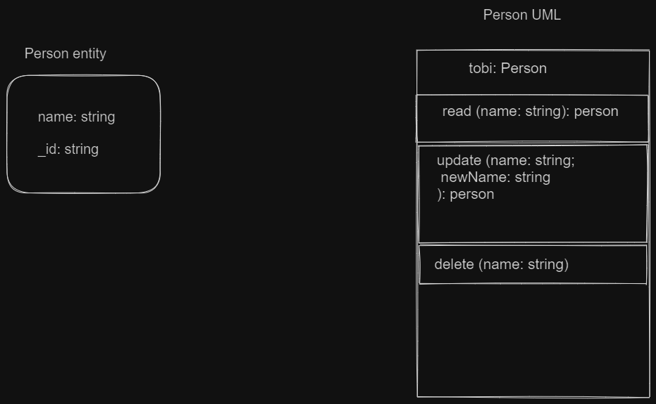

# Hng-stage2-task
## hng stage 2  backend task

### Task description
You are to build a simple REST API capable of CRUD operations on a "person" resource, interfacing with any database of your choice. Your API should dynamically handle parameters, such as adding or retrieving a person by name. Accompany the development with UML diagrams to represent your system's design and database structure. Create an automated testing script that verifies each of your API's operations. Host your entire project on GitHub, and provide a well-structured documentation in the repository that outlines request/response formats, setup instructions, and sample API usage.

### Tools used
primary: Node js is used to power this application;
other dependencies: express, typescript, express-validator, body-parser
Db: mongodb

### Summary of solution
for more details on the solution go further down.

The application creates a person, deletes a person, update a person, and get a person using the name of the person.

four endpoints were created to handle the CRUD operation, all of the endpoints receive necessary parameters via the request body, except for the update endpoint which receives an extra parameter, via the url.
once.

### Detailed approach to the solution

The application performs for independent tasks of creating, updating, fetching and deleting

To create:
to create a person resource, the POST method is used, and the route path is "/api", a request body with the name of the person should be provided for a successfull request.

this operation returns the created resource that is an object with the person just created

for example :
```
POST http://localhost:5000/api
body parameter=> {"name": "seun bamisebi"}
```
***note*** this application was designed to not have repetition of names, that is if a person resource with the same name provided exists, the request won't be successful.

To get:
to get a person resource, the GET method is used, and the route path is "/api", a request body with the name of the person should be provided for a successfull request.
on successful request, the person resourse is returned.

this operation returns the requested resource that is an object with the person name provided.

for example :
```
GET http://localhost:5000/api
body parameter=> {"name": "tobi bamisebi"}
```
***note*** each person has a unique id and name.

To update:
to update a person resource, the PUT method is used, and the route path is "/api/:name", the "name" of the user to be updated should be passed as a param to the url and a body with the updated name of the person should be provided for a successfull request.

this operation returns a message of a successful update.

for example :

```
 PUT http://localhost:5000/api/tobi
body parameter=> {"name": "tobi bamisebi"} 
```

To delete:
to delete a person resource, the PUT method is used, and the route path is "/api", a request body with the name of the person should be provided for a successfull request.

this operation returns a message of a successful deletion and now that name can be used to create a new person.

```
DELETE http://localhost:5000/api
body parameter=> {"name": "tobi bamisebi"} 
```

If the request was not successful, a message indicating what was wrong will be sent.


this application was tested thoroughly using postman, you can use any api testing platform.
***The request body doesn't have to be in a Json format, the urlEncoded format is also permitted***


# How to run this app locally

***note: kindly have node of version >16 installed for mongodb to run and kindly have typescript installed***
### steps:
- you can fork or clone this repository
- run npm install to install all necessary dependency
- create your mongodb atlas account, to get a free database
- once you have a mongodb atlas account, follow the steps given on the dashboard to connect your app to the database, this step will help you get a database uri
- add the uri gotten to your .env file with the right key which is ``MONGODB_URI``
- enter the following comand to then start the app ``npm run start``
- once the app starts you will see in the console what port it is being served on and you will also get a message displaying a secure connection to the database you created
- you can also start the server with this command ``ts-node src/index.ts``
- open your api platform testing app and you are good to go.


  Thank you.



